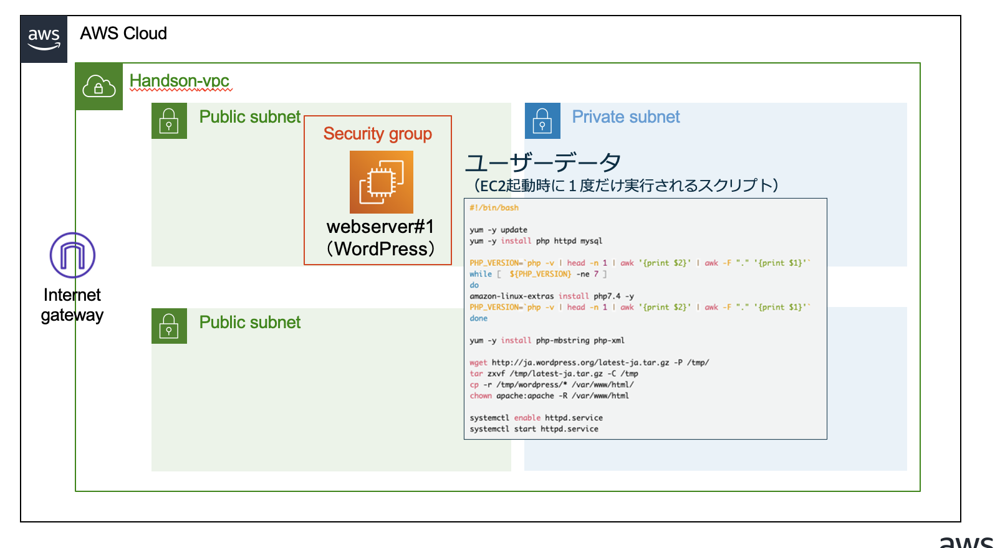

# スケーラブルハンズオン CDK実装サンプル

[スケーラブルハンズオン](https://catalog.us-east-1.prod.workshops.aws/workshops/47782ec0-8e8c-41e8-b873-9da91e822b36/ja-JP)の手順の一部を実装するCDKコードで、以下の要素を含みます

- ハンズオン用のVPC、サブネットのデプロイ
- WordPressを実行するためのEC2のデプロイ（ユーザデータ、IAMロールの設定含む）

[Amazon EC2 の作成](https://catalog.us-east-1.prod.workshops.aws/workshops/47782ec0-8e8c-41e8-b873-9da91e822b36/ja-JP/hands-on/phase2/phase2-2)までをCDKで実装します




## ディレクトリ構成

以下は重要なファイル·ディレクトリのみ記載しています。

```shell
.
├── README.md                       # 本READMEファイル
├── bin                             # スタックの定義
├── cdk.json                        # CDKの設定ファイル
├── jest.config.js                  # JavaScriptのフレームワークJestの設定ファイル
├── lib                             # CDK(Stack)の実装
│   ├── *****-stack.ts              # VPC、EC2（ユーザデータ含む）、IAM、Security GroupをデプロイするためのStack
├── package-lock.json               # ライブラリ依存関係の定義ファイル
├── package.json                    # ライブラリ依存関係の定義ファイル
├── test                            # CDKのテストコード(未使用)
└── tsconfig.json                   # TypeScriptの設定ファイル
```

## デプロイ方法

上記のリソースをAWSにデプロイする方法をまとめます。

### 準備・デプロイ

デプロイを実行する端末には、下記のソフトウェアが必要です。

- AWS CLI v2
- Node.js 14以上


まず初めに本リポジトリをお手元のCloud9環境にCloneします。

```shell
#ソースコードのClone
git clone https://github.com/kenicazu/scalable-webapp.git

cd scalable-webapp
```

カレントディレクトリにこの README.md が配置されていることを確認し、次のコマンドを実行します

```shell
# IaCの依存関係をインストール
npm ci

# CDKをap-northeast-1リージョンで使えるように初期化する
AWS_REGION=ap-northeast-1 npx cdk bootstrap

# CDKで定義したリソースのデプロイ
npx cdk deploy --require-approval never

```

なお、以下のコマンドでCloudFormationのyamlファイルを出力することも可能です。

```shell
cdk synth
```

一連プロセスは5分ほどで終了します。  
この後の手順は[スケーラブルハンズオンのWordPressのインストール確認](https://catalog.us-east-1.prod.workshops.aws/workshops/47782ec0-8e8c-41e8-b873-9da91e822b36/ja-JP/hands-on/phase2/phase2-3)から進めてください
